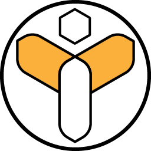

<!-- _coverpage.md -->

# Things Hive 

[comment]: <> (<small>3.5</small>)
[comment]: <> (### Bee  ![CMake]&#40;https://github.com/galalmounir/sandboxer/workflows/CMake/badge.svg?branch=master&#41;)

> Democratizing IoT Development

- Platform Independent
- Super Lightweight
- Designed For Resource-Constrained IoT Devices

[Get Started](pages/getting-started.md)
[About](pages/introduction.md)
