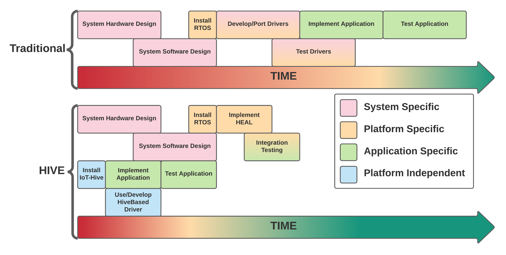

> [!NOTE]
> Some information is deliberately omitted. We will be releasing the full details once our research paper is published.

    
    
    
    
    
    

    
    

## Things Hive In a Flash
- A tiny footprint open-source scripting engine for resource-constrained IoT devices.
- Abstracts driver code from underlying hardware-dependent implementations.

## The Hive Architecture (Coming Soon)

## Development Journey
Using the Hive approach, IoT developers are able to become more streamlined when compared current contemporary methodologies.

***IoT Platform Development Journey***
